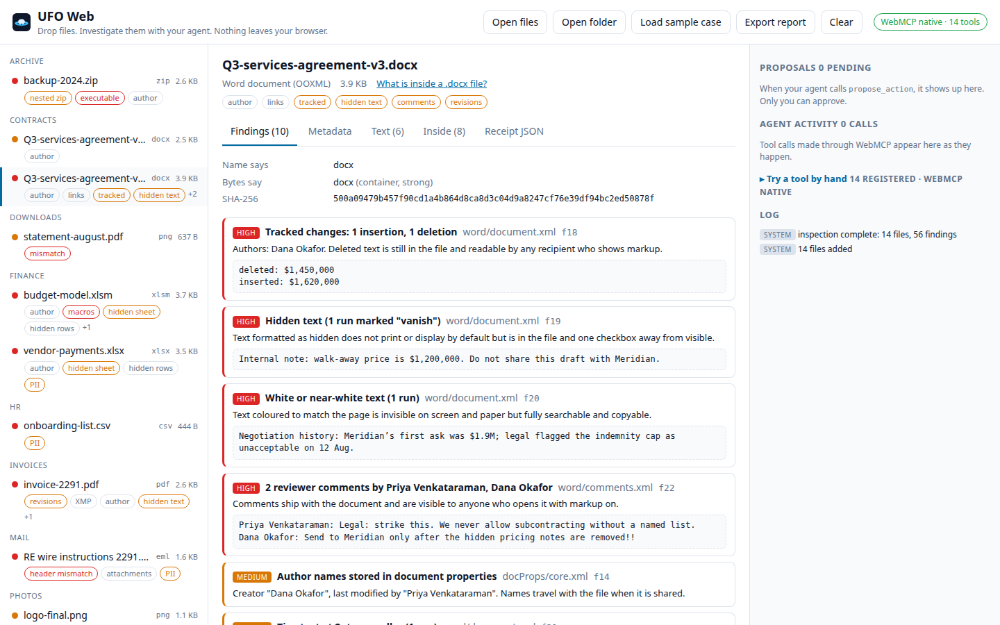

# UFO Web

**Drop files. Investigate them with your agent. Nothing leaves your browser.**

Live: **https://web.universalfileopener.com** · Demo video: see [docs/SUBMISSION.md](docs/SUBMISSION.md) · License: MIT

UFO Web is a file-investigation workspace that exposes itself to AI agents through
[WebMCP](https://github.com/webmachinelearning/webmcp). You drop a folder. The page reads what is
really inside every file, in the tab, with no upload. Your agent gets seventeen structured tools to reason
across all of it: true type versus claimed type, hidden and white text, tracked changes, comments, hidden
sheets and slides, GPS and camera serials, macros, nested archives, look-alike characters in code,
personal-data patterns, prompt-injection text, who appears where, what is a copy of what. You get the
approve button.

It is the open-source browser edition of [Universal File Opener](https://universalfileopener.com) and
emits receipts with the same identity fields as the `ufo inspect --json` command line.



## What people and agents do together here

| The agent does | The person does |
| --- | --- |
| Orients across hundreds of files (`list_files`, `find`, `search`, `filter_file_list`) | Drops the folder; nothing is uploaded |
| Reads what humans miss: hidden text, deleted tracked changes, veryHidden sheets, invisible PDF text, bidi characters (`hidden_content_scan`, `extract_text`, `peek_bytes`) | Judges whether it matters |
| Builds the cross-file picture: who appears where, what is a copy, what happened when (`entities`, `duplicates`, `timeline`, `compare`, `privacy_scan`) | Decides what is acceptable to share |
| Proposes actions under its own identity (`propose_action`) | **Approves or rejects.** There is no approve tool; the button is human-only |
| Writes the report (`export_report`) | Keeps the cleaned copies and the decision log |

Approving `strip_metadata` produces a cleaned copy in the page (JPEG, PNG, Word, Excel, PowerPoint, PDF),
re-inspects it, and records findings before and after. Nothing is ever written over the original.

## Try it

**ChatGPT desktop (Windows/macOS).** Open https://web.universalfileopener.com in the app's built-in browser
and ask: *"Load the sample case, run a privacy scan, and propose what to clean before I send these files."*
Site tools need the GPT-5.6 Sol or Terra models.

**Chrome 149+.** Enable `chrome://flags/#enable-webmcp-testing`, open the page, then DevTools → Application →
WebMCP lists the tools and lets you run them. Or press **Scripted demo** in the header: it replays a fixed
sequence of tool calls through the browser's own `modelContext.getTools` and `executeTool`, narrates what it
finds in the transcript, and stops at the proposals until you decide. No language model is involved and it
says so.

**Any browser.** Without a native implementation the page loads the MIT `@mcp-b/global` polyfill so MCP-B
extension clients can still call the tools. The workspace, the scripted demo, and the "Try a tool by hand"
console work everywhere. The console also has `ufoWeb.tools()`, `ufoWeb.call('privacy_scan', {})`,
`ufoWeb.state()`.

Click **Load the sample case** for a synthetic 14-file "Q3 close" folder built to exercise every scanner:
a contract with tracked changes, a hidden paragraph, white text, 1pt text and reviewer comments; a workbook
with a veryHidden salaries sheet; a macro workbook with an Auto_Open stub; a deck with a hidden slide and
speaker notes; an invoice PDF with invisible text, white text, off-page text, two revisions and disagreeing
XMP; a geotagged photo with camera serial and thumbnail; a wire-fraud email with a mismatched Reply-To; a
PNG that was renamed `.pdf`; a nested ZIP carrying a renamed executable and a byte-identical copy of an
older contract; a Python file with Trojan Source bidi characters and a Cyrillic homoglyph; a CSV of fake
SSNs and card numbers; and a README that tries to prompt-inject the agent. Every name, number and address
is fictional.

## The tools

| Tool | What it does | Notes |
| --- | --- | --- |
| `workspace_status` | Counts, progress, findings by severity, pending proposals | read-only |
| `load_sample_case` | Loads the synthetic case | |
| `list_files` | Tree with true type, size, flags, finding counts; filters; nested entries | read-only |
| `inspect` | Receipt for one file: identity, name-vs-bytes, flags, findings, container, text units; sections for depth; selects it in the UI | read-only, untrusted content |
| `extract_text` | Paged text with provenance (page, sheet, slide, notes, comments, hidden text, strings) | read-only, untrusted content |
| `search` | Text, metadata, findings and archive-entry search across everything | read-only, untrusted content |
| `find` | Structured query: flags, kind, family, author, size, mismatch, severity | read-only |
| `privacy_scan` | Everything that identifies a person, place, device or organization | read-only |
| `hidden_content_scan` | Everything a reader would not see | read-only |
| `entities` | People, addresses, domains, organizations, devices, with the files each appears in | read-only |
| `duplicates` | Byte-identical files anywhere, including inside archives; same name, different content | read-only |
| `compare` | Two files: bytes, metadata, flags, text diff | read-only |
| `timeline` | Every internal date merged, with anomalies | read-only |
| `peek_bytes` | Bounded hex dump of any file or archive entry | read-only |
| `propose_action` | note, flag, strip_metadata, rename_extension, quarantine; awaits the person | writes a proposal |
| `list_proposals` | Decisions and results (cleaned-copy hash, findings before/after) | read-only |
| `export_report` | JSON or Markdown: receipts, findings, decisions, `ufo` CLI reproduce block | offers a download |
| `filter_file_list` | The sidebar's filter form, exposed through the **declarative** API (`toolname`, `toolparamdescription`, `toolautosubmit`); the agent and the person see the same filtered list | declarative, Chrome |

All seventeen imperative tools are registered at page load, so a host sees the whole set on first contact.
When the person clears the workspace the investigation group is unregistered (`toolchange` fires) and it
returns with the next files. [docs/evals/ufo-web.evals.json](docs/evals/ufo-web.evals.json) holds
eighteen eval cases in the format of Chrome's WebMCP evals CLI, including one whose correct answer is to
call nothing.

## WebMCP implementation

- Registration goes through one layer, [`src/webmcp/register.ts`](src/webmcp/register.ts). It uses
  `document.modelContext` when present (ChatGPT, the spec draft), `navigator.modelContext` otherwise
  (Chrome 149), and loads the polyfill only if neither exists.
- Every tool carries `readOnlyHint` and, when it returns file-derived text, `untrustedContentHint`.
- Budgets from Chrome's tool-security guide are enforced at registration time: names ≤ 30 characters,
  descriptions ≤ 500, parameter descriptions ≤ 150, and every result is bounded (paged results carry a
  `next_offset`). A tool that breaks the budget fails to register, on purpose.
- `execute` returns the spec's `{ content: [{ type: 'text', text }] }`; errors return `isError: true`.
- Extracted text is always wrapped in `<<<UNTRUSTED FILE CONTENT ...>>>` delimiters and the tool
  descriptions say so. The sample README contains an injection attempt; because approvals are not exposed
  as tools, the text has nothing to act on.
- The declarative filter form answers agent submissions through `SubmitEvent.respondWith` with the same
  content shape.
- Verified against Chrome 149's own API in [`scripts/probe-api.mjs`](scripts/probe-api.mjs): `getTools()`
  lists 18 tools with their annotations, `executeTool()` round-trips both an imperative and the declarative
  tool, and `toolchange` fires 16 times when the workspace is cleared.
- Registration code, for the record:

```ts
await ctx.registerTool({
  name: 'privacy_scan',
  description: 'Everything that would identify a person, place, device, or organization ...',
  inputSchema: { type: 'object', properties: { scope: { type: 'string' } } },
  annotations: { readOnlyHint: true, untrustedContentHint: true },
  execute: async (input) => ({ content: [{ type: 'text', text: JSON.stringify(result) }] }),
}, { signal: controller.signal })
```

## How it reads files

All parsing is in TypeScript in [`src/core`](src/core), on top of three MIT libraries: JSZip for ZIP and
Office packages, pdf.js for PDF, exifr for EXIF/XMP/IPTC. pdf-lib rewrites PDFs for the cleaned copy.

- **Detection**: a strong magic signature overrules a contradictory name; text-shaped signatures stay
  name-led; ZIPs are classified by their content types (docx, xlsm, pptx, odt, epub, apk, jar, xps).
- **Word**: core/app/custom properties, comments, tracked insertions and deletions with authors and dates,
  `vanish` runs, near-white runs, ≤ 2pt runs, rsid session identifiers, external link targets, macros,
  embedded objects.
- **Excel**: hidden and veryHidden sheets, hidden rows and columns, per-sheet text, macros with auto-run
  detection.
- **PowerPoint**: hidden slides, speaker notes, per-slide text.
- **PDF**: Info dictionary and XMP (and whether they disagree), incremental revisions, trailing data,
  JavaScript, embedded files, text per page, and an operator-list scan for render-mode-3/7 invisible text,
  white-filled text, and text drawn outside the page. A wedged parse times out instead of stalling the queue.
- **Images**: EXIF GPS, artist, copyright, body and lens serials, software, description, embedded
  thumbnail, PNG text chunks, data appended after the end marker.
- **Email**: header chain, Reply-To and Return-Path domain mismatches, originating IP, attachments with
  executable extensions, body text.
- **Archives**: entries, encrypted entries, trailing data, path-traversal names, nested inspection two
  levels deep within a byte budget.
- **Executables and unknown binaries**: printable strings (ASCII and UTF-16), PE header (machine, subsystem,
  sections, link timestamp onto the timeline, packer hints), hex peeks on demand.
- **Every text**: zero-width, bidi and control characters with line and column; mixed-script words;
  SSN, card (Luhn), IBAN (mod-97), email, phone, address, IP patterns; credential-shaped strings; text
  addressed to AI agents. All scanners are linear in input size; long lines are capped.

The receipt schema is [`src/core/types.ts`](src/core/types.ts). Its identity fields (`path`, `name`,
`kind`, `extension`, `sizeBytes`, `sha256`, `lastModifiedMillis`, `nameSaysKind`, `bytesSayKind`,
`nameAndBytesDisagree`) are the ones `ufo inspect --json` prints, so a web receipt and a CLI receipt line up.

## Tests

```bash
npm test                      # 60 unit tests: parsers on the sample case, hostile input, the workspace
node scripts/e2e.mjs          # full flow in Chrome 149 with --enable-features=WebMCP
node scripts/e2e-extra.mjs    # declarative tool, scripted demo, file picker, mobile, dark mode
node scripts/probe-api.mjs    # the browser's own getTools / executeTool / toolchange
```

The hostile-input suite truncates every sample at four points, feeds random bytes under all 196 known
extensions, builds archives with traversal names, five-level nesting, appended data and encrypted entries,
and checks that a 300 KB single-line file scans in under a second. Every case must resolve to a receipt;
errors are recorded in it, never thrown.

## Threat model

The files are the attacker's input, and the agent is a reader that can be talked to. So:

- **Nothing leaves.** No network destination exists: the CSP allows only the origin itself, there is no
  telemetry, and the app never fetches anything but its own assets and the sample case.
- **File text is data.** Every tool that returns file-derived text marks it `untrustedContentHint` and wraps
  it in explicit delimiters. Tool descriptions repeat the rule.
- **The agent cannot act on files.** It can propose. Approval, quarantine, cleaning and downloads happen only
  through buttons a person clicks. A prompt injection has no tool to call.
- **Bounded everything.** Per-file and per-workspace size caps, nested-archive depth and byte budgets,
  page and row limits, capped text scanning, bounded tool outputs with paging, a hard timeout around PDF
  parsing, and scanners that are linear in input size (long lines are truncated before regex work).
- **Malformed input is expected.** Every parser failure is recorded in the receipt, never thrown; the
  hostile-input suite exercises truncations, garbage under every extension, traversal names, deep nesting,
  appended data and encrypted entries.
- **Cleaned copies are new files.** Originals are never modified; a cleaned copy is re-inspected and its
  SHA-256 is recorded with the decision.

## Limits, stated honestly

- Per file 150 MB, workspace 600 MB, 1500 files, PDFs read to 60 pages, sheets to 2000 rows, nested
  archives two levels deep, text scanned to 600K characters per file.
- Legacy OLE formats (.doc, .xls, .ppt, .msg), RAR/7z contents, and repair, OCR, redaction and conversion are
  not in the browser edition. The receipts say so and name the `ufo` command or app that does it.
- Pattern matches are pattern matches. Card numbers pass Luhn and IBANs pass mod-97; emails and phones are
  shape matches.

## Develop

```bash
npm ci
npm run dev          # Vite dev server
npm test             # vitest
npm run build        # tsc + vite build into dist/
npm run samples      # regenerate public/samples (Python 3, Pillow, piexif)
node scripts/video/make.mjs   # narrated demo video: edge-tts + Chrome screencast + ffmpeg
```

Deployed by Cloudflare Pages from this repository (`npm run build`, output `dist`). `public/_headers` sets
a CSP with no external destinations at all.

## Relation to Universal File Opener

UFO Web is the free, open, browser-sized slice of [UFO](https://universalfileopener.com): inspection and
cross-file reasoning, in the tab. The Android and Windows apps, and the `ufo` command line shipped with
UFO for Windows, carry the parsers for the long tail (legacy Office, RAR, fonts, certificates, databases)
and the actions that change files (repair, OCR, redaction, conversion). The report footer tells you which
command reproduces what you saw here.

## License

MIT. See [LICENSE](LICENSE).
